# Live Simulation Run Workflow

## Overview

This document describes how FourCore handles a live simulation run after a user selects **Simulate Now**. It covers the supported entry points, global target availability checks, vector-specific pre-checks, live behavior execution, runtime exception handling, WAF post-run validation, and final report transitions.

## Workflow Diagram

```mermaid
flowchart TD
  subgraph Entry["Entry Points"]
    PB[Playbook Runs]
    IS[Individual<br/>Simulation Runs]
    TI[Threat Intelligence<br/>Runs]
    ET[Emerging Threats<br/>Runs]
    RR[Re-test from<br/>Reports]
    RW[Re-test from<br/>Remediations]
    OE[Other Entry<br/>Points]
    SN[Simulate Now]
    ILR[Initialize<br/>Live Run]

    PB --> SN
    IS --> SN
    TI --> SN
    ET --> SN
    RR --> SN
    RW --> SN
    OE --> SN
    SN --> ILR
  end

  subgraph Global["Global Pre-check"]
    GTA[Check target<br/>availability]
    ATA{Are selected<br/>targets available?}
    MUT[Mark unavailable<br/>targets]
    CWA[Continue with<br/>reachable targets]
    PVP[Proceed to<br/>vector pre-checks]

    GTA --> ATA
    ATA -- "All available" --> PVP
    ATA -- "Some unavailable" --> MUT
    MUT --> CWA
    CWA --> PVP
  end

  subgraph Vector["Vector-specific Pre-checks"]
    WV{Which vector<br/>is simulated?}

    EP[Endpoint pre-checks<br/>Build payloads and stages<br/>Check elevation and users<br/>Verify stage and payload]
    EPP{Endpoint<br/>checks passed?}
    EPF[Endpoint pre-check<br/>failure]
    EPA[Abort before<br/>behaviors start]

    EM[Email pre-checks<br/>Verify stage connected<br/>Check timeout]
    EMP{Email checks<br/>passed?}
    EMF[Email pre-check<br/>failure]
    EMA[Abort before<br/>behaviors start]

    WAF[WAF pre-checks<br/>Verify stage connected<br/>Check timeout]
    WAFP{WAF checks<br/>passed?}
    WAFF[WAF pre-check<br/>failure]
    WAFA[Abort before<br/>behaviors start]

    NET[Network pre-checks<br/>Verify stage connected<br/>Check timeout]
    NETP{Network checks<br/>passed?}
    NETF[Network pre-check<br/>failure]
    NETA[Abort before<br/>behaviors start]

    WV --> EP --> EPP
    WV --> EM --> EMP
    WV --> WAF --> WAFP
    WV --> NET --> NETP

    EPP -- "No" --> EPF --> EPA
    EMP -- "No" --> EMF --> EMA
    WAFP -- "No" --> WAFF --> WAFA
    NETP -- "No" --> NETF --> NETA
  end

  subgraph Live["Live Simulation Execution"]
    SBS[Start behavior<br/>simulation]
    RB[Run behaviors]
    TR[Track results on<br/>targets and assets]
    UP[Update overall<br/>progress]
    LS[Show live status<br/>and logs]
    LD[Live page shows<br/>behaviors, target results,<br/>progress, errors, status,<br/>and outcomes]

    WK{Was endpoint<br/>payload killed?}
    RPT[Retry payload<br/>on target]
    IKC[Increment<br/>kill count]
    K3{Killed 3 times<br/>on this target?}
    AST[Abort simulation<br/>on this target]
    OTR{Are other targets<br/>still running?}
    CRT[Continue on<br/>remaining targets]

    IE[Internal runtime<br/>error]
    SAB[Simulation<br/>aborted]
    ARS[Show aborted<br/>run summary]

    BCT[Behavior completed<br/>on target]
    HAF{Have all behaviors<br/>finished running?}

    SBS --> RB --> TR --> UP --> LS --> LD
    LS --> WK
    WK -- "No" --> BCT
    WK -- "Yes" --> RPT --> IKC --> K3
    K3 -- "No" --> RPT
    K3 -- "Yes" --> AST --> OTR
    OTR -- "Yes" --> CRT --> RB
    OTR -- "No" --> HAF

    LS --> IE
    IE --> SAB --> ARS

    BCT --> HAF
    HAF -- "No" --> RB
  end

  subgraph WafPost["WAF Post-run Condition"]
    WRC{WAF run?}
    CM{Condition<br/>matched?}
    MM[Condition<br/>mismatch]
    MWR[Show report with<br/>mismatch warning]
    WFD[Send to final<br/>outcome]

    WRC -- "No" --> WFD
    WRC -- "Yes" --> CM
    CM -- "Yes" --> WFD
    CM -- "No" --> MM --> MWR --> WFD
  end

  subgraph Report["Final Outcome / Report"]
    EOF[Evaluate final<br/>outcome]
    DAT{Did all selected<br/>targets finish?}
    SC[Simulation<br/>completed]
    TRP[Transition to<br/>report page]
    SFA[Show final<br/>analytics]
    PSC[Partial simulation<br/>completed]
    PTP[Transition to<br/>partial report]
    SPA[Show partial<br/>analytics]

    EOF --> DAT
    DAT -- "Yes" --> SC --> TRP --> SFA
    DAT -- "No" --> PSC --> PTP --> SPA
  end

  ILR --> GTA
  PVP --> WV
  EPP -- "Yes" --> SBS
  EMP -- "Yes" --> SBS
  WAFP -- "Yes" --> SBS
  NETP -- "Yes" --> SBS
  HAF -- "Yes" --> WRC
  ARS --> EOF
  WFD --> EOF

  classDef action fill:#eef4ff,stroke:#2563eb,color:#0f172a,stroke-width:1px
  classDef decision fill:#ffffff,stroke:#1d4ed8,color:#0f172a,stroke-width:2px
  classDef success fill:#ecfdf5,stroke:#16a34a,color:#064e3b,stroke-width:1px
  classDef error fill:#fef2f2,stroke:#dc2626,color:#7f1d1d,stroke-width:1px
  classDef warning fill:#fff7ed,stroke:#f97316,color:#7c2d12,stroke-width:1px
  classDef endpoint fill:#eff6ff,stroke:#2563eb,color:#0f172a,stroke-width:1px
  classDef email fill:#f5f3ff,stroke:#7c3aed,color:#0f172a,stroke-width:1px
  classDef waf fill:#f0fdf4,stroke:#16a34a,color:#0f172a,stroke-width:1px
  classDef network fill:#fff7ed,stroke:#ea580c,color:#0f172a,stroke-width:1px

  class PB,IS,TI,ET,RR,RW,OE,SN,ILR,GTA,MUT,CWA,PVP,SBS,RB,TR,UP,LS,LD,RPT,IKC,CRT,BCT,WFD,TRP,SFA,PTP,SPA action
  class ATA,WV,EPP,EMP,WAFP,NETP,WK,K3,OTR,HAF,WRC,CM,DAT decision
  class SC success
  class EPF,EPA,EMF,EMA,WAFF,WAFA,NETF,NETA,IE,SAB,ARS,AST error
  class PSC,MM,MWR warning
  class EP,EPP endpoint
  class EM,EMP email
  class WAF,WAFP waf
  class NET,NETP network
```

## Major Workflow Phases

### 1. Entry Points

Users can start a live simulation from playbook runs, individual simulation runs, threat intelligence runs, emerging threat runs, report re-tests, remediation workflow re-tests, or other supported FourCore entry points. All paths converge on **Simulate Now**, then initialize a live run.

### 2. Global Pre-check

FourCore first checks whether selected targets are available and reachable. If all selected targets are available, the run proceeds directly to vector-specific pre-checks. If some targets are unavailable, FourCore marks those targets and continues with the reachable targets.

### 3. Vector-specific Pre-checks

The selected vector determines which pre-check branch runs before behaviors begin:

- **Endpoint:** Builds payloads and stages, checks elevation, validates required AD or local users, and verifies stage and payload connectivity.
- **Email:** Verifies stage connectivity and checks for connection timeout before start.
- **WAF:** Verifies stage connectivity and checks for connection timeout before start.
- **Network:** Verifies stage connectivity and checks for connection timeout before start.

Any vector-specific pre-check failure aborts the simulation before behavior execution starts.

### 4. Live Simulation Execution

After pre-checks pass, FourCore starts behavior simulation, runs behaviors, tracks target and asset results, updates progress, and shows live status and logs. The live run page displays behavior state, target results, overall progress, live errors and warnings, runtime status, and final behavior outcomes.

### 5. WAF Post-run Condition

For WAF simulations, FourCore evaluates the post-run condition after simulation completion. If the condition matches, the run continues to final outcome evaluation. If it does not match, the report is shown with a mismatch warning.

### 6. Final Outcome / Report

When the run is ready for final evaluation, FourCore determines whether all selected targets finished. Fully completed simulations transition to the report page with final analytics. Partial simulations transition to a partial report with partial analytics.

## Workflow Notes

- **Global availability logic:** Unavailable targets do not automatically cancel the entire run. FourCore marks unavailable targets and continues with available, reachable targets where possible.
- **Pre-check failure vs. runtime failure:** Pre-check failures happen before behaviors start and abort the affected simulation path early. Runtime failures happen after execution begins and may abort a target, abort the full run, or produce an aborted run summary depending on the failure type.
- **Endpoint retry logic:** If an endpoint payload is killed, FourCore retries the payload on that target and increments the kill count. After three kills on the same target, simulation is aborted for that target.
- **Partial simulation logic:** If a target aborts but other targets are still running, FourCore continues on the remaining targets. If not all selected targets finish, the run becomes a partial simulation and transitions to partial analytics.
- **Email, WAF, and Network runtime errors:** Internal runtime errors in these vectors abort the simulation and show an aborted run summary.
- **WAF condition mismatch logic:** A WAF run can complete behavior execution but still produce a post-run condition mismatch. In that case, FourCore shows the report with a mismatch warning.
